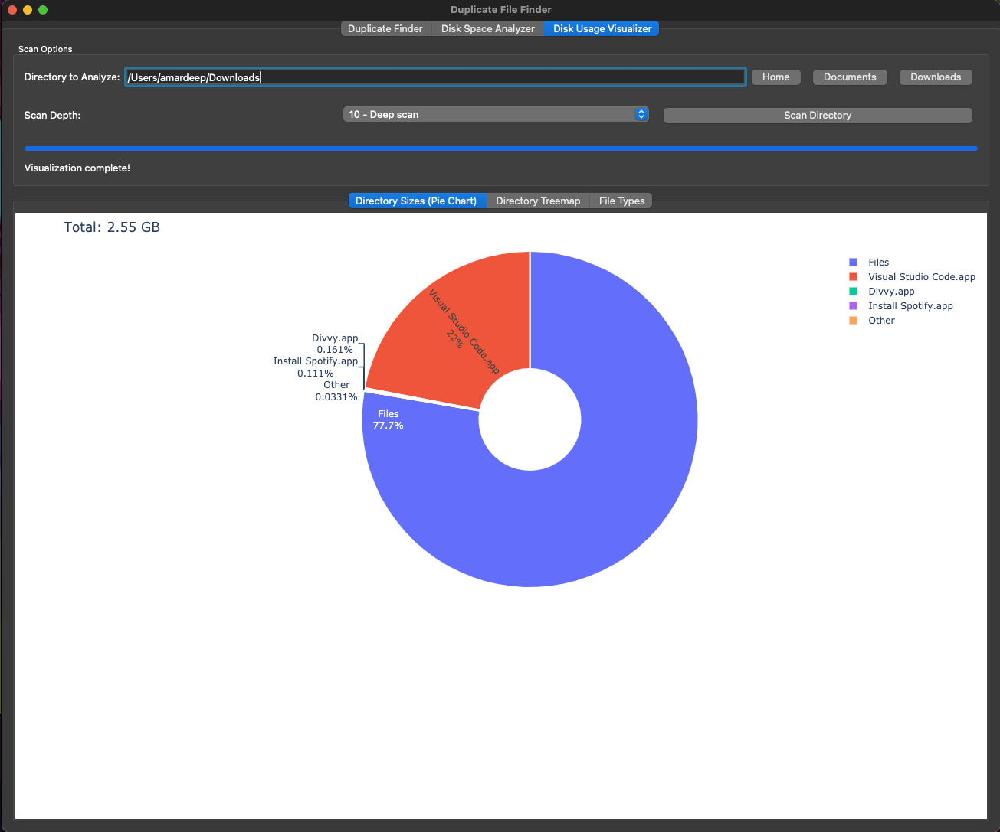

# Duplicate File Finder

A desktop application to find duplicate files and analyze disk space.

## Features

- **Duplicate File Finder**:
  - Scan any directory for duplicate files.
  - Filter by file extensions and minimum file size.
  - Choose between content hash, file size, or filename comparison.
  - View duplicate groups and delete unwanted files.
  - Export results to CSV.
- **Disk Space Analyzer**:
  - Analyze disk space usage for any drive.
  - Find the largest files to identify what's taking up space.
  - Find the largest folders to see which directories are the biggest.
  - Delete files directly from the results list.
- **Disk Usage Visualizer**:
  - Interactive charts to visualize disk usage.
  - Pie chart and treemap for directory sizes.
  - Bar chart for file types breakdown.

## Screenshots

<table align="center">
  <tr>
    <td></td>
    <td></td>
  </tr>
  <tr>
    <td align="center"><em>Duplicate Finder</em></td>
    <td align="center"><em>Disk Analyzer</em></td>
  </tr>
  <tr>
    <td></td>
    <td></td>
  </tr>
  <tr>
    <td align="center"><em>Disk Usage Chart</em></td>
    <td align="center"><em>Disk Usage Analyzer</em></td>
  </tr>
</table>

## How It Works

The application is built with Python and the PyQt5 framework for the graphical user interface. Here's a breakdown of how the core features work:

### Duplicate File Finder

The duplicate finding process is optimized for performance:

1.  **Scanning**: The application walks through the selected directory to gather all files that match the filter criteria (extensions, size).
2.  **Grouping**:
    -   **Content Hash**: To avoid hashing every single file, the scanner first groups files by their size. Only files with identical sizes are considered potential duplicates.
    -   **Hashing**: For each group of same-sized files, an MD5 hash is calculated for each file. To speed up this process, hashing is done in parallel using multiple CPU cores (`multiprocessing`). Files with the same hash are confirmed as duplicates.
    -   **Other Methods**: The "File Size" and "Filename" methods are faster as they only rely on file metadata and don't read the file content.
3.  **Results**: The groups of duplicate files are then displayed in the results table.

### Disk Space Analyzer

The analyzer scans the filesystem to find the largest files and folders:

-   **Scanning**: It uses a separate thread (`QThread`) to perform the scan in the background, ensuring the UI remains responsive.
-   **File Discovery**: For large files, it iterates through the directory tree and keeps track of the top files based on their size.
-   **Folder Discovery**: For large folders, it recursively calculates the total size of each directory by summing up the sizes of all files and subdirectories within it.

### Disk Usage Visualizer

The visualizer uses the `plotly` library to create interactive charts:

-   **Data Collection**: Similar to the analyzer, it scans the selected directory to get information about directory sizes and file types.
-   **Chart Generation**: The collected data is then used to generate:
    -   A **pie chart** and a **treemap** to visualize the relative sizes of directories.
    -   A **bar chart** to show the space occupied by different file extensions.
-   **Interactivity**: The charts are displayed using a web engine view within the application, allowing for hovering to see details, zooming, and more.

## Installation

### Prerequisites

- Python 3.11 or higher
- See `requirements.txt` for all package dependencies.

### Setup

1. Clone the repository:
```bash
git clone https://github.com/yourusername/duplicate-file-finder.git
cd duplicate-file-finder
```

2. Create a virtual environment:
```bash
python -m venv venv

# On Windows:
venv\Scripts\activate

# On macOS/Linux:
source venv/bin/activate
```

3. Install dependencies:
```bash
pip install -r requirements.txt
```

## Usage

Run the application:
```bash
python app.py
```

## Building a Standalone Executable (Optional)

You can create a standalone executable using PyInstaller:

```bash
pip install pyinstaller
pyinstaller --onefile --windowed app.py
```

The executable will be created in the `dist` directory.

## Contributing

Contributions are welcome! Please feel free to submit a Pull Request.

## License

This project is licensed under the MIT License.